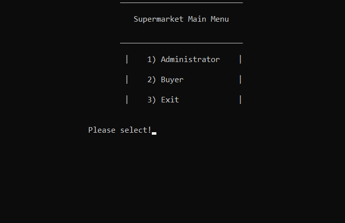
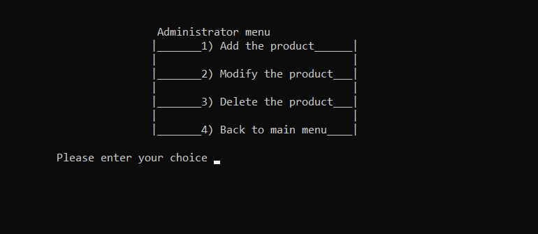
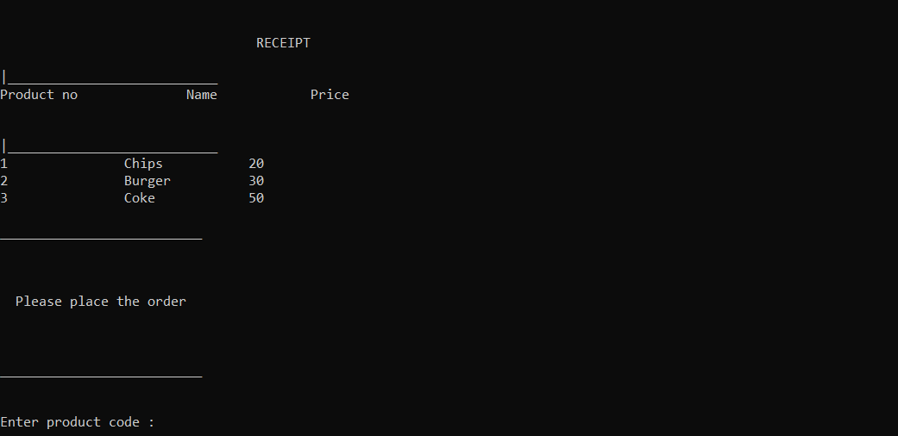

# Supermarket Billing System

It is a billing system for supermarket, which provides option to login as an administrator(password protected) or as a buyer. 

ADMINISTRATOR-> 
As an administrator, you can ADD, MODIFY and DELETE the product. While you try to login as an administrator, it will ask for an email and a password, and you won't be able to login if any of them mismatches. The FSTREAM function is used for file handling. When you will add the products, they will be added in a file named database which will be created at the same location. When you will modify or delete the product from the application, the corresponding changes will also be reflected in the file.

BUYER->
When you login as a buyer, it will show you the list of all the products,along with the details, that are present in the file. You will have to type the product code and quantity that you want to purchase. When you are done shopping, it will print your total bill along with the details on the screen.

# Samples

- Sample 1 (Home)

- Sample 2 (Administrator Menu)

- Sample 3 (Buyer Menu)

